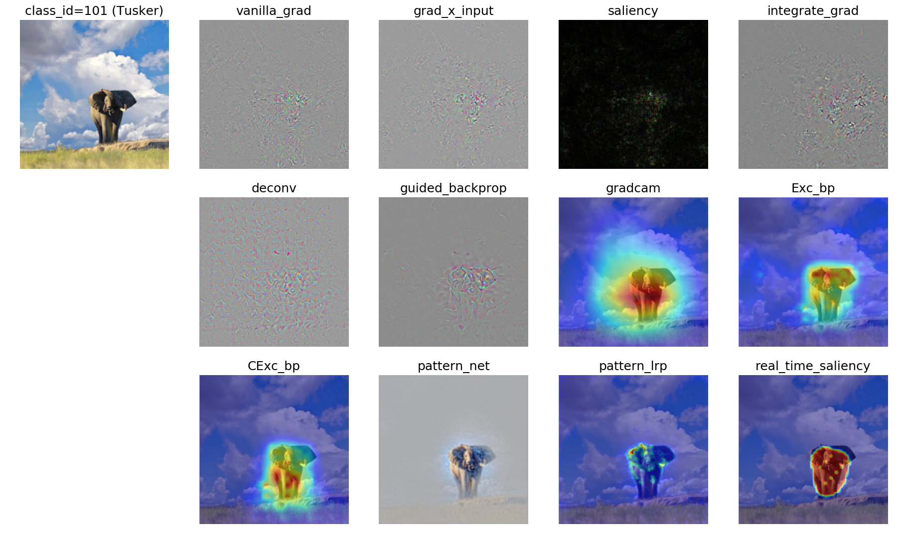

# Pytorch Visual Attribution Methods

A collection of visual attribution methods for model interpretability



Including:
- [x] Vanilla Gradient Saliency
- [x] Grad X Input
- [x] Integrated Gradient
- [x] SmoothGrad
- [x] Deconv
- [x] Guided Backpropagation
- [x] Excitation Backpropagation, Contrastive Excitation Backpropagation
- [x] GradCAM
- [x] PatternNet, PatternLRP
- [x] Real Time Saliency
- [ ] Occlusion
- [ ] Feedback
- [ ] DeepLIFT
- [ ] Meaningful Perturbation

## Setup

### Prerequisities
- Linux
- NVIDIA GPU + CUDA (Current only support running on GPU)
- Python 3.x
- PyTorch version == **0.2.0** (Sorry I haven't tested on newer versions)
- torchvision, skimage, matplotlib

### Getting Started
- Clone this repo:
```bash
git clone git@github.com:yulongwang12/visual-attribution.git
cd visual-attribution
```
- Download pretrained weights
```bash
cd weights
bash ./download_patterns.sh  # for using PatternNet, PatternLRP
bash ./download_realtime_saliency.sh # for using Real Time Saliency
```
**Note**: I convert caffe bvlc_googlenet pretrained models in pytorch format (see `googlenet.py` and `weights/googlenet.pth`). 

### Visual Saliency Comparison
see notebook [saliency_comparison.ipynb](./notebooks/saliency_comparison.ipynb). If everything works, you will get the above image.

### Weakly Supervised Object Localization
TBD

## Reference
TBD
